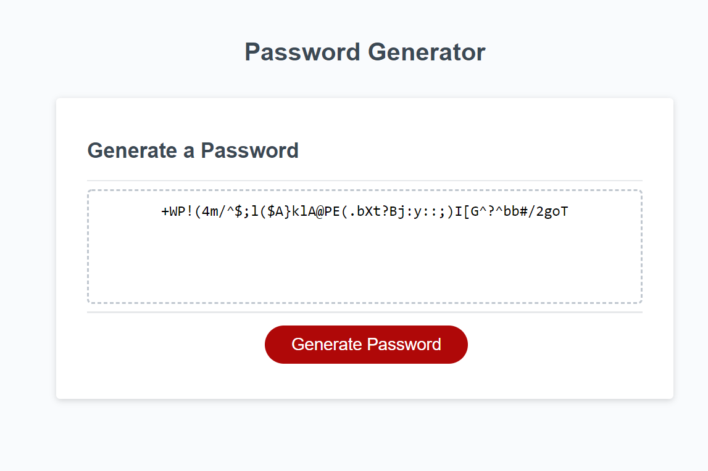

# Passsword Generator
An application that generated a random password based on user-selected criteria

## Application Launch
Please use the link [here](https://zanhong.github.io/3-password-generator/)

## Description
- This application prompts users for password criteria (length of password and character types - lowercase, uppercase, numbers and/or special characters)
- A randomly generated password will be displayed in the textbox when the "Generate Password" button is clicked
- If user is not satisfied with the current displayed password, pressing the button again will generate another password of the same criteria

## Screenshot of the Application

